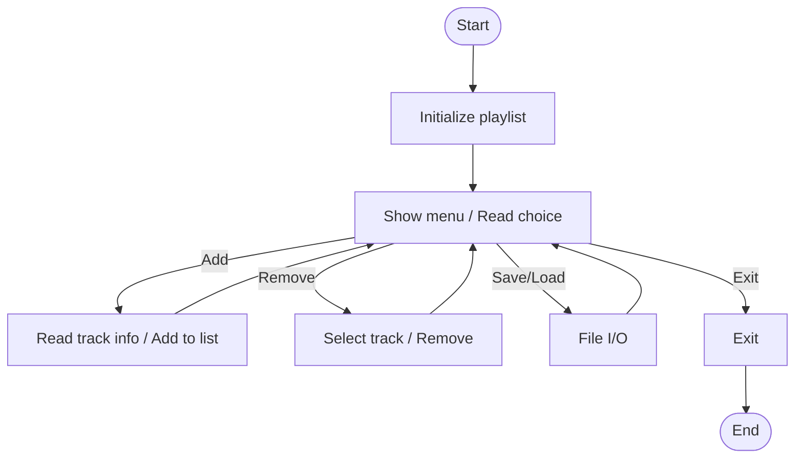

# audio_playlist.c

Description

A simple audio playlist simulator demonstrating basic list operations (add, remove, display) and file I/O concepts in C.

Features

- Manage a playlist (add/remove tracks)
- Save/load playlist to/from file
- Demonstrates linked list usage (or array usage depending on implementation)

Compile (Windows PowerShell)

```powershell
gcc -o audio_playlist.exe audio_playlist.c
.\audio_playlist.exe
```

Usage

Run the compiled executable and follow the menu prompts. Example: add tracks, list them, save to disk, exit.

## Code flow (Mermaid flowchart)



Notes

- Replace with your program-specific details if behavior differs.
