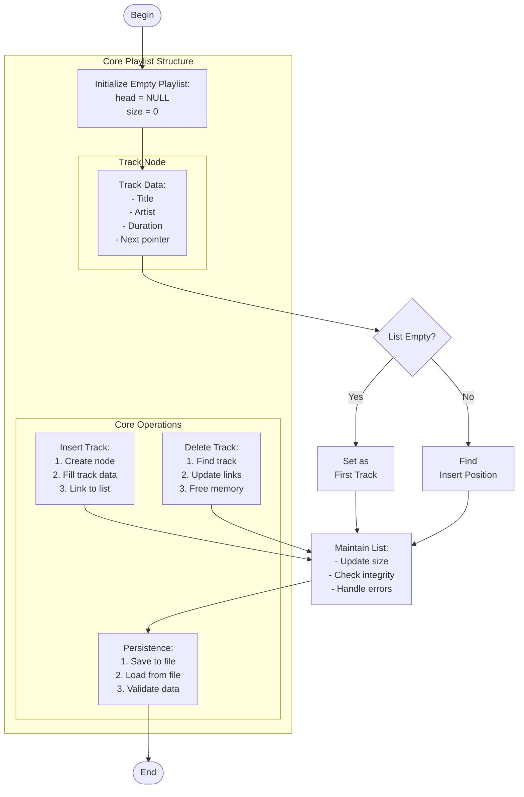

# audio_playlist.c

Description

A simple audio playlist simulator demonstrating basic list operations (add, remove, display) and file I/O concepts in C.

Features

- Manage a playlist (add/remove tracks)
- Save/load playlist to/from file
- Demonstrates linked list usage (or array usage depending on implementation)

Compile (Windows PowerShell)

```powershell
gcc -o audio_playlist.exe audio_playlist.c
.\audio_playlist.exe
```

Usage

Run the compiled executable and follow the menu prompts. Example: add tracks, list them, save to disk, exit.

## Core Algorithm (Mermaid flowchart)



Algorithm explanation:
1. Data Structure:
   - Linked list for dynamic sizing
   - Each node contains track info
   - Maintain head and size
2. Core Operations:
   - Insert: O(1) at head/tail
   - Delete: O(n) search + O(1) remove
   - Persistence: Sequential file I/O
3. Error Handling:
   - Empty list cases
   - Memory allocation
   - File operations

Notes

- Linked list provides flexible track ordering
- File I/O ensures playlist persistence