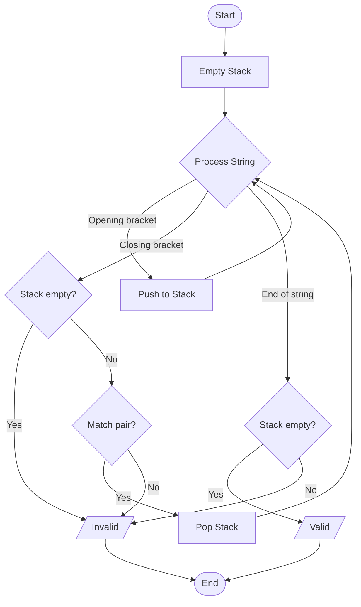
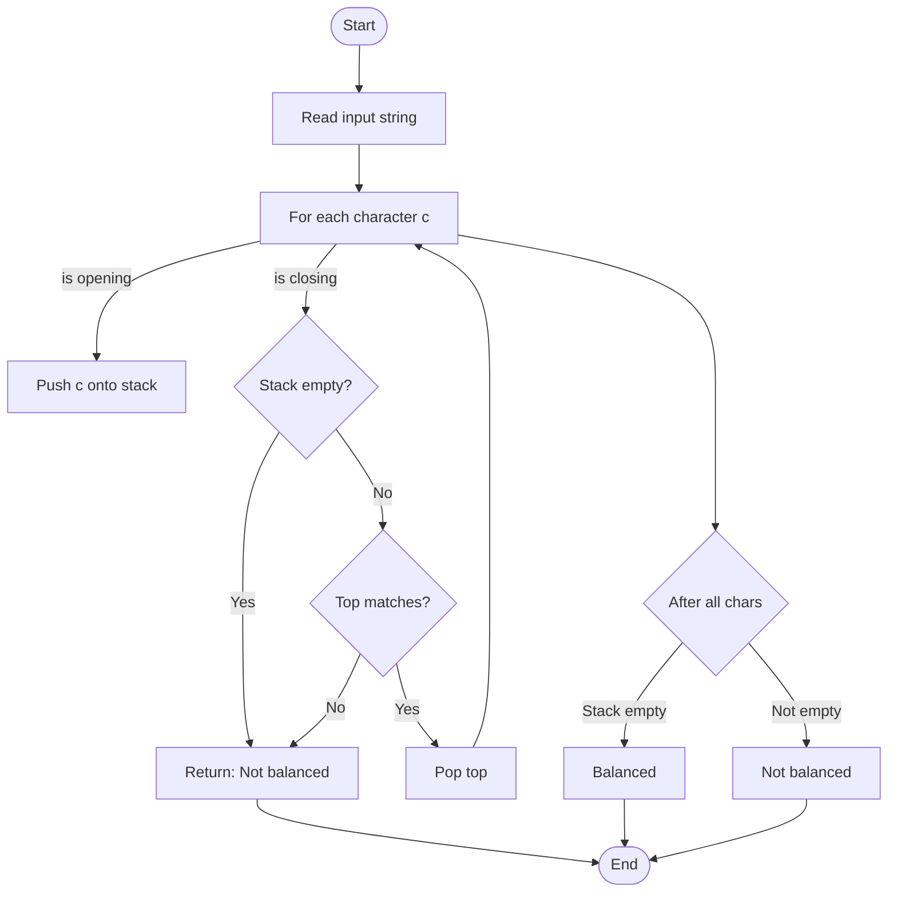

# balanced_parentheses.c

Description

Checks if an input string has balanced parentheses/brackets/braces using a stack. Typical problem for validating expressions.

Features

- Supports (), [], {}
- Uses stack to push opening brackets and pop on matching closing brackets

Compile (Windows PowerShell)

```powershell
gcc -o balanced_parentheses.exe balanced_parentheses.c
.\balanced_parentheses.exe
```

Usage

Provide an expression when prompted; program outputs whether parentheses are balanced.

## Algorithm for Checking Balanced Parentheses



Algorithm explanation:
1. Create an empty stack to store opening brackets
2. For each character in the string:
   - If it's an opening bracket: push to stack
   - If it's a closing bracket:
     * If stack is empty → invalid
     * If stack top doesn't match → invalid
     * If matches → pop stack and continue
3. After processing all characters:
   - If stack is empty → string is valid
   - If stack is not empty → missing closing brackets → invalid
        
        ScanStr --> IsOpen{Is opening bracket?}
        IsOpen -->|Yes| PushOp[Push to stack]
        IsOpen -->|No| IsClose{Is closing bracket?}
        
        IsClose -->|No| NextChar[Next character]
        IsClose -->|Yes| CheckEmpty{Stack empty?}
        
        CheckEmpty -->|Yes| Invalid[Invalid]
        CheckEmpty -->|No| PopCompare[Pop & compare]
        
        PopCompare -->|Match| NextChar
        PopCompare -->|No Match| Invalid
        
        NextChar --> More{Còn ký tự?}
        More -->|Yes| ScanStr
        More -->|No| FinalCheck
    end
    
    subgraph "Final Check"
        FinalCheck{Stack empty?} -->|Yes| Valid[Balanced]
        FinalCheck -->|No| Invalid
    end
```

Notes

- Handle edge cases: empty string, non-bracket chars ignored or considered depending on implementation.

## Core algorithm (Mermaid flowchart)


