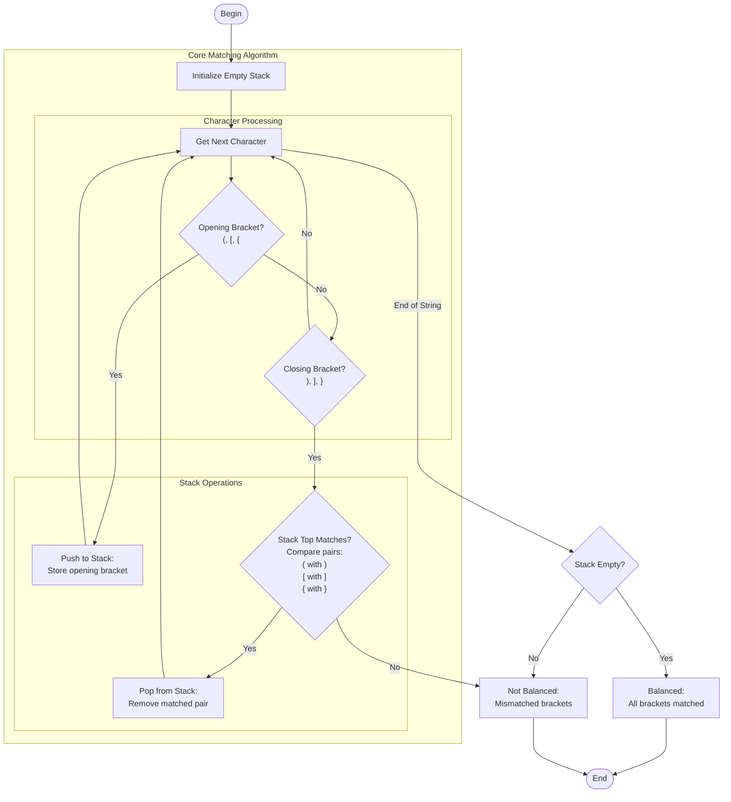

# balanced_parentheses.c

Description

Checks if an input string has balanced parentheses/brackets/braces using a stack. Typical problem for validating expressions.

Features

- Supports (), [], {}
- Uses stack to push opening brackets and pop on matching closing brackets

Compile (Windows PowerShell)

```powershell
gcc -o balanced_parentheses.exe balanced_parentheses.c
.\balanced_parentheses.exe
```

Usage

Provide an expression when prompted; program outputs whether parentheses are balanced.

## Core Algorithm (Mermaid flowchart)



Algorithm explanation:
1. Use stack for bracket matching:
   - Push opening brackets onto stack
   - Match closing brackets with stack top
   - Pop when pairs match correctly
2. Key validations:
   - Stack empty for closing bracket = Invalid
   - Mismatched brackets = Invalid
   - Non-empty stack at end = Invalid
3. Time complexity: O(n)
   - Single pass through string
   - Constant time operations

Notes

- Handle edge cases: empty string, non-bracket chars ignored
- Stack ensures proper nesting order