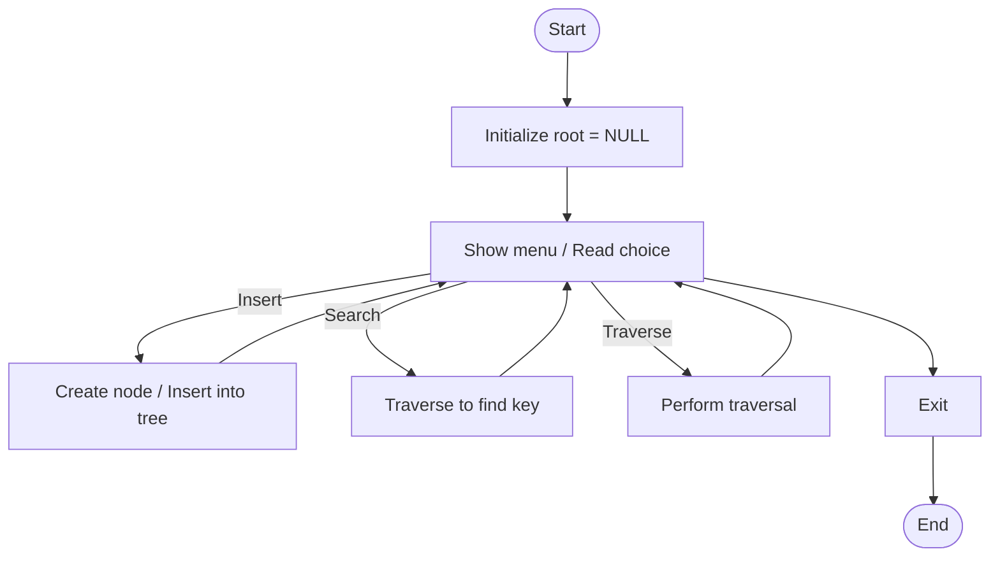

# car_tree.c

Description

Implements a tree (or binary tree) structure representing car data (e.g., models, categories) and supports traversal/search operations.

Features

- Insert car nodes
- Search by key
- Traversals (inorder/preorder/postorder)

Compile (Windows PowerShell)

```powershell
gcc -o car_tree.exe car_tree.c
.\car_tree.exe
```

Usage

Run the program and use the menu to insert/search/traverse nodes.

## Code flow (Mermaid flowchart)



Notes

- If your implementation is different (AVL, BST), update README accordingly.
