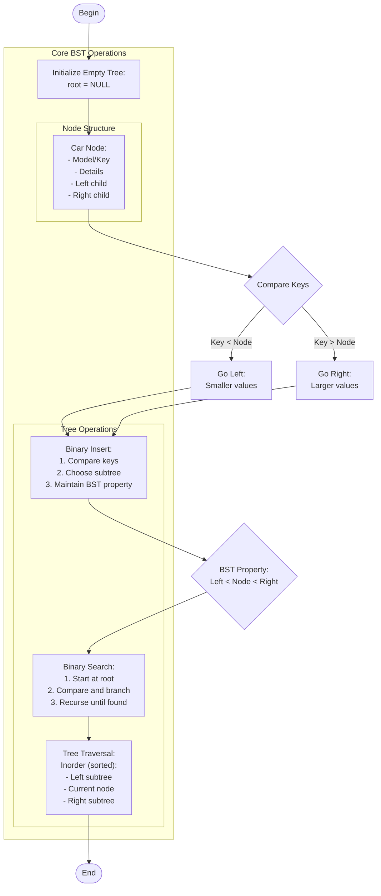

# car_tree.c

Description

Implements a tree (or binary tree) structure representing car data (e.g., models, categories) and supports traversal/search operations.

Features

- Insert car nodes
- Search by key
- Traversals (inorder/preorder/postorder)

Compile (Windows PowerShell)

```powershell
gcc -o car_tree.exe car_tree.c
.\car_tree.exe
```

Usage

Run the program and use the menu to insert/search/traverse nodes.

## Core Algorithm (Mermaid flowchart)



Algorithm explanation:
1. Binary Search Tree:
   - Each node has up to 2 children
   - Left subtree contains smaller keys
   - Right subtree contains larger keys
2. Time Complexity:
   - Insert: O(log n) average
   - Search: O(log n) average
   - Traversal: O(n)
3. Optimization:
   - Balance tree for best performance
   - Handle duplicates appropriately

Notes

- Tree balance affects performance
- Inorder traversal gives sorted output