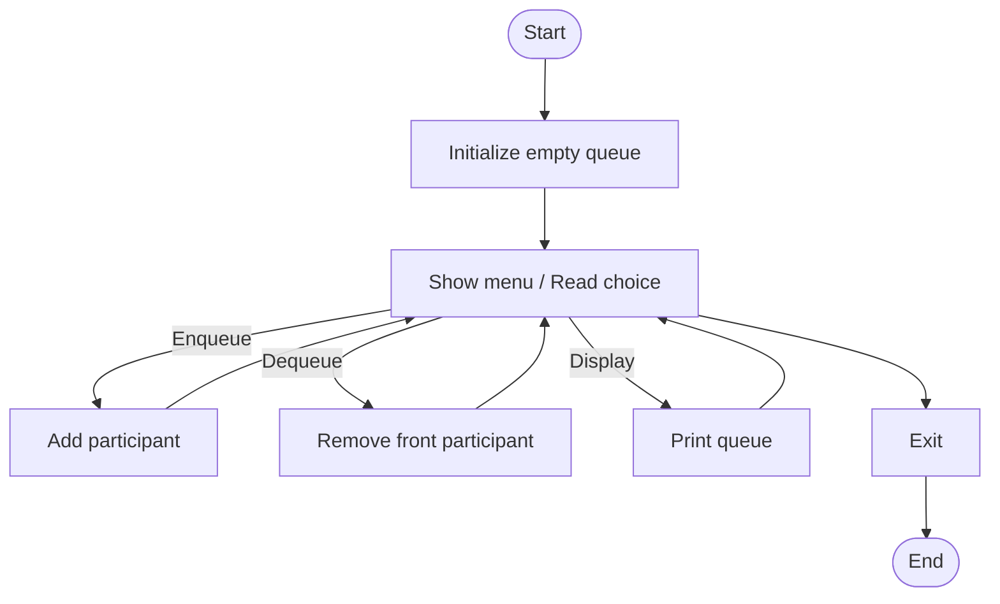

# congo_line.c

Description

Simulates a conga line or queue behavior, often used to demonstrate queue operations (enqueue, dequeue) in C.

Features

- Enqueue and dequeue operations
- Display queue
- Circular queue or linked list-based queue depending on implementation

Compile (Windows PowerShell)

```powershell
gcc -o congo_line.exe congo_line.c
.\congo_line.exe
```

Usage

Run and follow menu to add/remove participants and view the line.

## Code flow (Mermaid flowchart)



Notes

- Update commands if your program accepts arguments instead of interactive menu.
