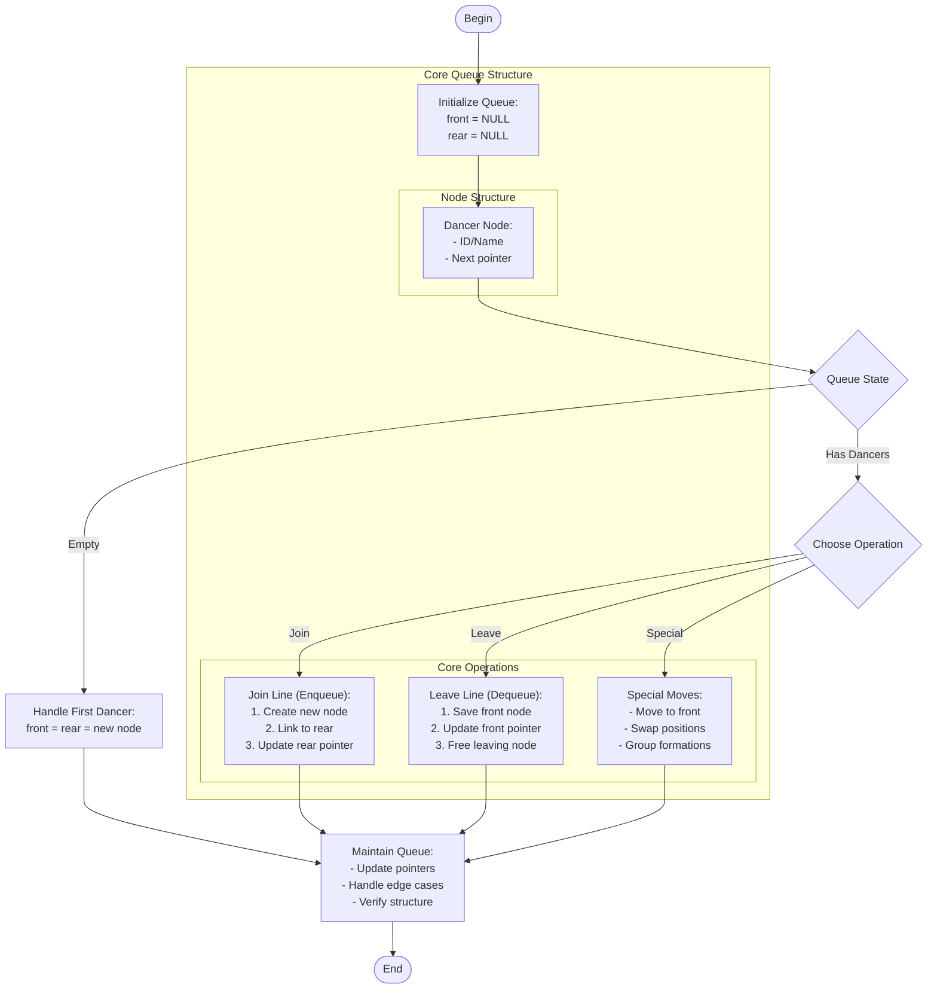

# congo_line.c

Description

Simulates a conga line or queue behavior, often used to demonstrate queue operations (enqueue, dequeue) in C.

Features

- Enqueue and dequeue operations
- Display queue
- Circular queue or linked list-based queue depending on implementation

Compile (Windows PowerShell)

```powershell
gcc -o congo_line.exe congo_line.c
.\congo_line.exe
```

Usage

Run and follow menu to add/remove participants and view the line.

## Core Algorithm (Mermaid flowchart)



Algorithm explanation:
1. Queue Implementation:
   - Linked list for dynamic size
   - Front/rear pointers for O(1) access
   - Special move operations
2. Core Operations:
   - Enqueue: O(1) at rear
   - Dequeue: O(1) at front
   - Special moves: O(n) search + O(1) update
3. Edge Cases:
   - Empty queue handling
   - Single dancer operations
   - Full queue scenarios

Notes

- Linked list allows dynamic line size
- Special moves maintain queue integrity