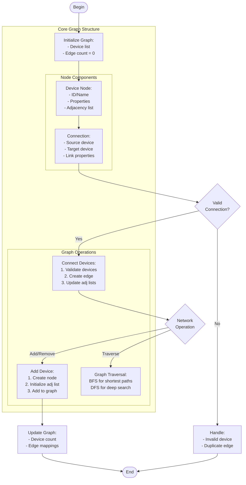

# device_nodes.c

Description

Manages a list or graph of device nodes. Could demonstrate adjacency lists, device registration, or traversal routines.

Features

- Add/remove devices
- Connect devices (edges)
- Traverse network

Compile (Windows PowerShell)

```powershell
gcc -o device_nodes.exe device_nodes.c
.\device_nodes.exe
```

Usage

Run the program and interact via menu or provide input file describing nodes/edges.

## Core Algorithm (Mermaid flowchart)



Algorithm explanation:
1. Graph Implementation:
   - Adjacency list for connections
   - O(1) device lookup
   - O(degree) connection checks
2. Core Operations:
   - Device management: O(1)
   - Connection updates: O(1)
   - Traversal: O(V + E)
3. Memory Efficiency:
   - Sparse graph optimization
   - Minimal edge storage

Notes

- Adjacency list preferred for sparse device networks
- Consider connection validation rules