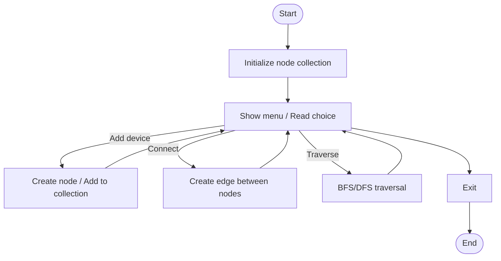

# device_nodes.c

Description

Manages a list or graph of device nodes. Could demonstrate adjacency lists, device registration, or traversal routines.

Features

- Add/remove devices
- Connect devices (edges)
- Traverse network

Compile (Windows PowerShell)

```powershell
gcc -o device_nodes.exe device_nodes.c
.\device_nodes.exe
```

Usage

Run the program and interact via menu or provide input file describing nodes/edges.

## Code flow (Mermaid flowchart)



Notes

- If this program models a specific protocol or data structure, include those details here.
