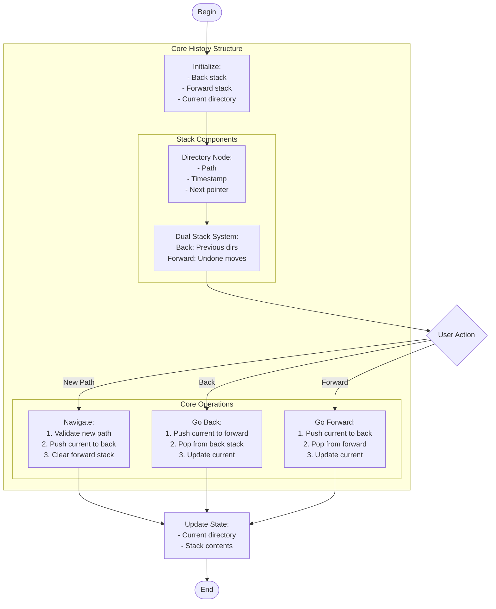

# directory_history.c

Description

Tracks navigation history of directories (like a shell history), demonstrating stack/linked-list usage to go back/forward in history.

Features

- Push directory on navigation
- Back/forward operations
- Display history

Compile (Windows PowerShell)

```powershell
gcc -o directory_history.exe directory_history.c
.\directory_history.exe
```

Usage

Run and use menu: navigate to new directory (push), go back (pop), view history.

## Core Algorithm (Mermaid flowchart)



Algorithm explanation:
1. Data Structure:
   - Two stacks for bidirectional history
   - O(1) operations for all actions
   - Efficient memory management
2. Core Operations:
   - Navigate: Clear forward history
   - Back/Forward: Move between stacks
   - All operations maintain consistency
3. Path Handling:
   - Validate directories
   - Normalize paths
   - Error checking

Notes

- Similar to browser history mechanics
- Can be extended to persist between sessions