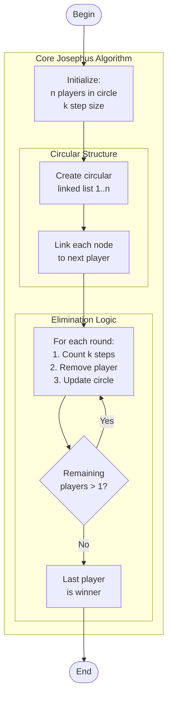

# elimination_game.c

Description

Simulates an elimination game (Josephus problem or similar) removing players in rounds until one remains.

Features

- Simulate elimination order
- Parameterize step size and list size

Compile (Windows PowerShell)

```powershell
gcc -o elimination_game.exe elimination_game.c
.\elimination_game.exe
```

Usage

Provide number of players and step size; program prints elimination order and winner.

## Core Algorithm (Mermaid flowchart)



Algorithm explanation:
1. Initialization:
   - Create circular linked list
   - Each node: player number & next pointer
2. Game Logic:
   - Count k steps to find target
   - Remove player & update links
   - Track elimination order
3. Optimization:
   - Use circular list for efficiency
   - Single traversal per elimination
   - O(n) space complexity

Notes

- For large n, consider O(n) simulation vs mathematical solution.