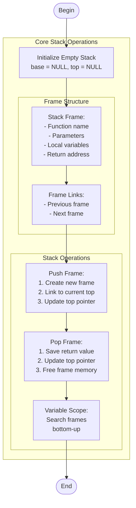

# function_call_stack.c

Description

Demonstrates how a function call stack works: stack frames, parameters, local variables, return addresses, and simulated recursion.

Features

- Push/pop function frames
- Add parameters and local variables
- Simulate recursion (factorial example)
- Display current frame and entire call stack

Compile (Windows PowerShell)

```powershell
gcc -o function_call_stack.exe function_call_stack.c
.\function_call_stack.exe
```

Usage

Run the program and use the interactive menu to push/pop calls, add variables, simulate recursion, and observe stack behavior.

## Core Algorithm (Mermaid flowchart)



Algorithm explanation:
1. Stack Frame Management:
   - Push: Create frame with function info & parameters
   - Pop: Save return value, free variables, update links
   - Maintains proper call hierarchy
2. Variable Scope:
   - Variables belong to specific frames
   - Search follows scope rules (bottom-up)
3. Frame Structure:
   - Each frame contains function context
   - Linked list implementation for stack

Notes

- This program is educational; it simulates stack frames in C structures rather than the CPU call stack.