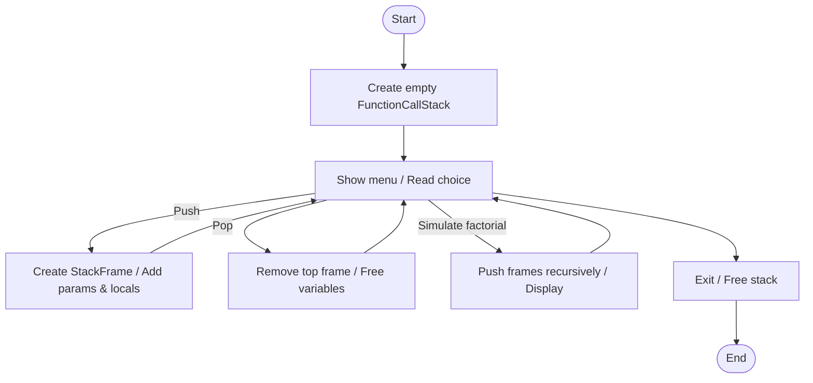
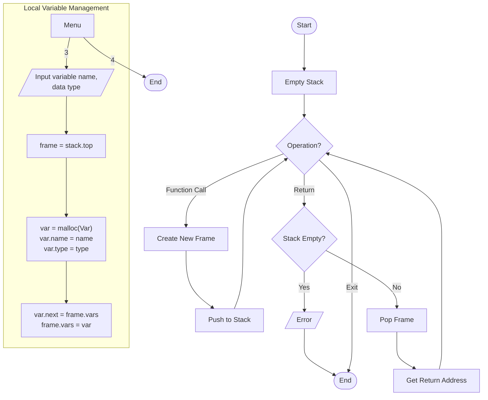

# function_call_stack.c

Description

Demonstrates how a function call stack works: stack frames, parameters, local variables, return addresses, and simulated recursion.

Features

- Push/pop function frames
- Add parameters and local variables
- Simulate recursion (factorial example)
- Display current frame and entire call stack

Compile (Windows PowerShell)

```powershell
gcc -o function_call_stack.exe function_call_stack.c
.\function_call_stack.exe
```

Usage

Run the program and use the interactive menu to push/pop calls, add variables, simulate recursion, and observe stack behavior.

## Code flow (Mermaid flowchart)



Notes

- This program is educational; it simulates stack frames in C structures rather than the CPU call stack.

## Function Call Stack Algorithm



Algorithm explanation:
1. Stack Frame Management:
   - Push: Create new frame → link to stack top
   - Pop: Get top frame → save return address → free
2. Local Variables:
   - Add to current frame using linked list
   - Automatically freed when frame is popped
3. Tracking:
   - Current frame count
   - Return address for each frame
   - Local variables per frame
        AllocFrame --> SetInfo[Set function name, ID, return address]
        SetInfo --> LinkFrame[Link frame to stack top]
        LinkFrame --> UpdateStack[Increment frame count & execution level]
    end
    
    subgraph "Pop Function Call"
        Pop([Return]) --> GetTop[Get top frame]
        GetTop --> SaveRet[Save return value/address]
        SaveRet --> UnlinkFrame[Unlink from stack]
        UnlinkFrame --> CleanVars[Free local variables]
        CleanVars --> DecLevel[Decrement execution level]
    end
    
    subgraph "Variable Management"
        AddVar([Add variable]) --> AllocVar[Allocate memory for variable]
        AllocVar --> FindScope[Find current frame]
        FindScope --> LinkVar[Link to frame's variable list]
    end
```
