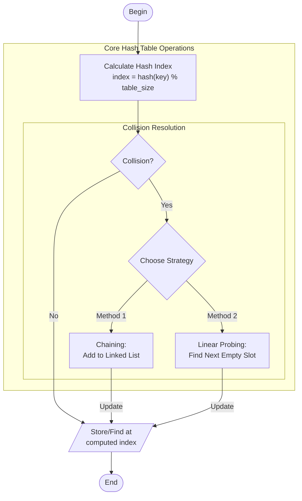

# hash_table.c

Description

Implements a hash table with insert/search/delete operations and collision handling (chaining or open addressing).

Features

- Insert key/value
- Search by key
- Delete key
- Collision resolution

Compile (Windows PowerShell)

```powershell
gcc -o hash_table.exe hash_table.c
.\hash_table.exe
```

Usage

Run and use menu-driven operations to test the hash table.

## Core Algorithm (Mermaid flowchart)



Algorithm explanation:
1. Hash Function:
   - Map key to table index
   - Handle negative keys
   - Ensure uniform distribution
2. Collision Resolution:
   - Chaining: Each slot has linked list
   - Linear Probing: Try next slots
3. Operations:
   - Insert: Handle collisions appropriately
   - Search: Follow chain or probe sequence
   - Delete: Special handling for probing scheme

Notes

- Mention the chosen hash function and table size if fixed in your implementation.