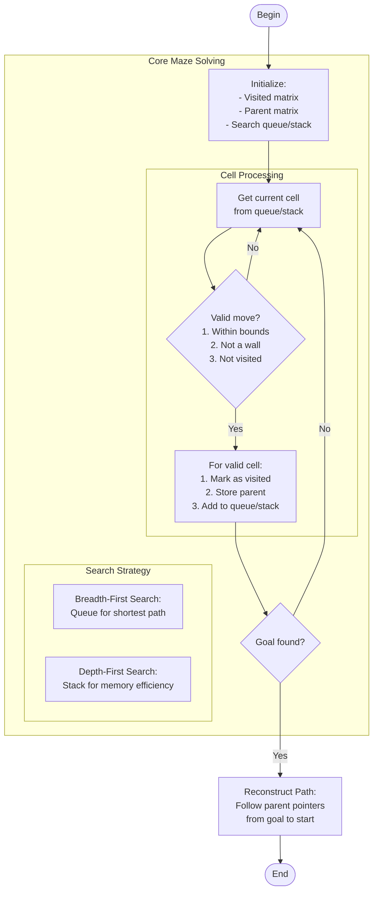

# maze_solver.c

Description

Solves mazes using search algorithms (DFS, BFS, A* optionally). Demonstrates grid traversal, visited marking, and path reconstruction.

Features

- Read maze from input or file
- Solve using BFS/DFS
- Print solved path and steps

Compile (Windows PowerShell)

```powershell
gcc -o maze_solver.exe maze_solver.c
.\maze_solver.exe
```

Usage

Provide maze input (or file). Program outputs path if exists.

## Core Algorithm (Mermaid flowchart)



Algorithm explanation:
1. Core components:
   - Visited matrix prevents cycles
   - Parent matrix tracks path
   - Queue/Stack for search frontier
2. Key operations:
   - Check cell validity
   - Mark and track visited cells
   - Store path information
3. Path reconstruction:
   - Follow parent pointers
   - Build path in reverse

Notes

- BFS guarantees shortest path
- DFS uses less memory
- For larger mazes, consider A* with heuristics