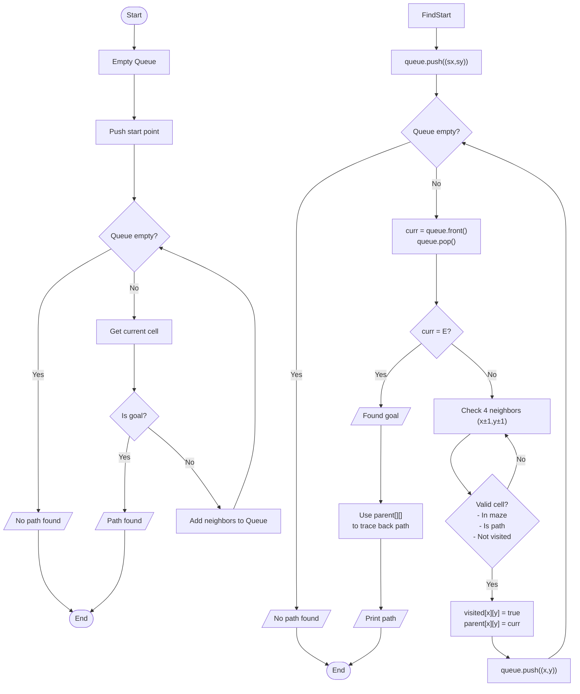

# maze_solver.c

Description

Solves mazes using search algorithms (DFS, BFS, A* optionally). Demonstrates grid traversal, visited marking, and path reconstruction.

Features

- Read maze from input or file
- Solve using BFS/DFS
- Print solved path and steps

Compile (Windows PowerShell)

```powershell
gcc -o maze_solver.exe maze_solver.c
.\maze_solver.exe
```

Usage

Provide maze input (or file). Program outputs path if exists.

## Code flow (Mermaid flowchart)

```mermaid
flowchart TD
  Start([Start]) --> Read[Read maze into 2D array]
  Read --> Choose[Choose algorithm (BFS/DFS)]
  Choose --> Search[Search loop: push/enqueue neighbors, mark visited]
  Search -->|Goal found| Reconstruct[Reconstruct path]
  Reconstruct --> Print[Print path]
  Search -->|No path| NoPath[Report no path]
  Print --> End([End])
  NoPath --> End
```

Notes

- For larger mazes, BFS guarantees shortest path; A* is faster with good heuristics.

## Maze Solving Algorithm (BFS)



Algorithm explanation:
1. Initialization:
   - visited matrix to mark visited cells
   - parent matrix to store parent cells (for path tracking)
   - Empty queue for BFS
2. BFS path finding:
   - Start from cell S, end when E is found
   - For each cell, add valid neighbors to queue
   - Mark visited and store parent when visiting new cells
3. Path reconstruction:
   - Use parent[][] to trace back from E to S
   - Print the path or report if no path found
        ReadMaze --> InitVisited[Initialize visited matrix]
    end

    subgraph "BFS Implementation"
        BFS([BFS Start]) --> CreateQ[Create empty queue]
        CreateQ --> EnqStart[Enqueue start point]
        EnqStart --> BFSLoop{Queue empty?}
        
        BFSLoop -->|No| Dequeue[Get queue front]
        Dequeue --> CheckGoal1{Is Goal?}
        CheckGoal1 -->|Yes| Found1[Path found]
        CheckGoal1 -->|No| GetNeighbors1[Get neighbors]
        GetNeighbors1 --> EnqNeighbors[Enqueue unvisited cells]
        EnqNeighbors --> BFSLoop
    end

    subgraph "DFS Implementation"
        DFS([DFS Start]) --> CreateS[Create empty stack]
        CreateS --> PushStart[Push start point]
        PushStart --> DFSLoop{Stack empty?}
        
        DFSLoop -->|No| Pop[Get top element]
        Pop --> CheckGoal2{Is goal?}
        CheckGoal2 -->|Yes| Found2[Path found]
        CheckGoal2 -->|No| GetNeighbors2[Get neighbors]
        GetNeighbors2 --> PushNeighbors[Push unvisited cells]
        PushNeighbors --> DFSLoop
    end

    subgraph "Path Reconstruction (Phục hồi đường đi)"
        Found1 --> Backtrack[Trace path from goal to start]
        Found2 --> Backtrack
        Backtrack --> BuildPath[Create path array]
        BuildPath --> Output[In đường đi]
    end
```
