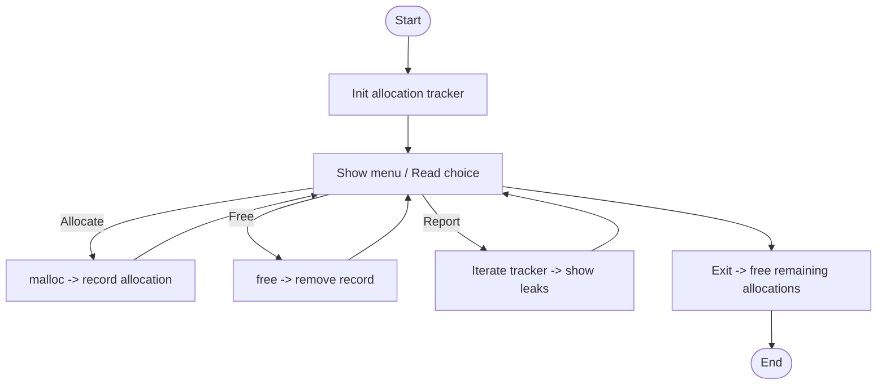
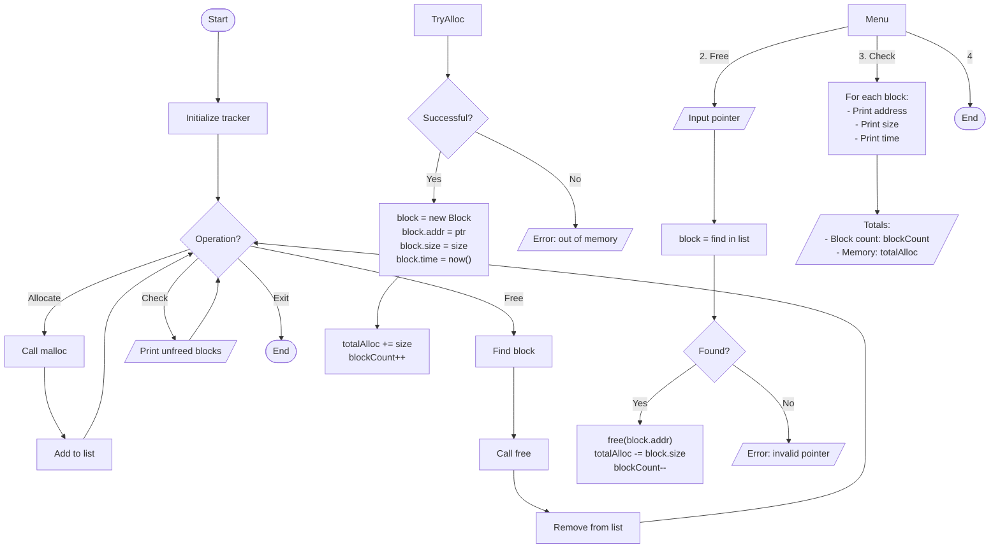

# memory_management.c

Description

Demonstrates manual memory management techniques in C: allocation, deallocation, tracking allocations, and detecting leaks.

Features

- Allocate/free blocks
- Track active allocations
- Optionally simulate simple allocator

Compile (Windows PowerShell)

```powershell
gcc -o memory_management.exe memory_management.c
.\memory_management.exe
```

Usage

Run and follow menu to allocate and free memory. Use provided tracking output to inspect leaks.

## Code flow (Mermaid flowchart)



Notes

- This program is educational; use Valgrind (on Linux) for real leak detection.

## Memory Management Algorithm



Algorithm explanation:
1. Allocation:
   - malloc() + check success
   - Create new block record
   - Update statistics
2. Deallocation:
   - Find block in list
   - free() if found
   - Update statistics
3. Leak checking:
   - List all unfreed blocks
   - Show total statistics
        CreateTracker --> InitList[Initialize blocks list]
    end

    subgraph "Allocation Management"
        Alloc([Allocate]) --> CallMalloc[Call malloc()]
        CallMalloc --> CreateRecord[Create new record]
        CreateRecord --> FillInfo[Store size, address, time]
        FillInfo --> AddToList[Add to blocks list]
    end

    subgraph "Deallocation"
        Free([Free]) --> FindBlock[Find block in list]
        FindBlock --> ValidPtr{Valid pointer?}
        ValidPtr -->|Yes| CallFree[Call free()]
        ValidPtr -->|No| Error[Report error]
        CallFree --> RemoveRecord[Remove from list]
    end

    subgraph "Leak Detection"
        Check([Check]) --> ScanList[Scan blocks list]
        ScanList --> FilterOld[Filter old blocks]
        FilterOld --> ReportLeaks[Report leaks]
    end
```
