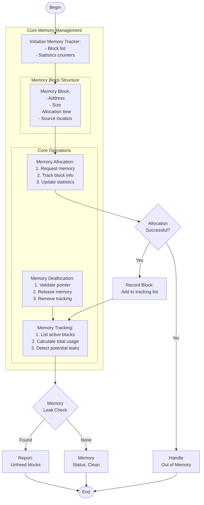

# memory_management.c

Description

Demonstrates manual memory management techniques in C: allocation, deallocation, tracking allocations, and detecting leaks.

Features

- Allocate/free blocks
- Track active allocations
- Optionally simulate simple allocator

Compile (Windows PowerShell)

```powershell
gcc -o memory_management.exe memory_management.c
.\memory_management.exe
```

Usage

Run and follow menu to allocate and free memory. Use provided tracking output to inspect leaks.

## Core Algorithm (Mermaid flowchart)



Algorithm explanation:
1. Memory Block Tracking:
   - Track each allocation's metadata
   - Maintain linked list of active blocks
   - Record allocation details for debugging
2. Core Operations:
   - Allocation: malloc + tracking
   - Deallocation: free + cleanup
   - Leak detection: analyze active blocks
3. Memory Safety:
   - Validate all pointers
   - Track allocation sizes
   - Monitor total memory usage

Notes

- This program is educational; use Valgrind (on Linux) for real leak detection.
- Focus on understanding memory lifecycle and common issues.