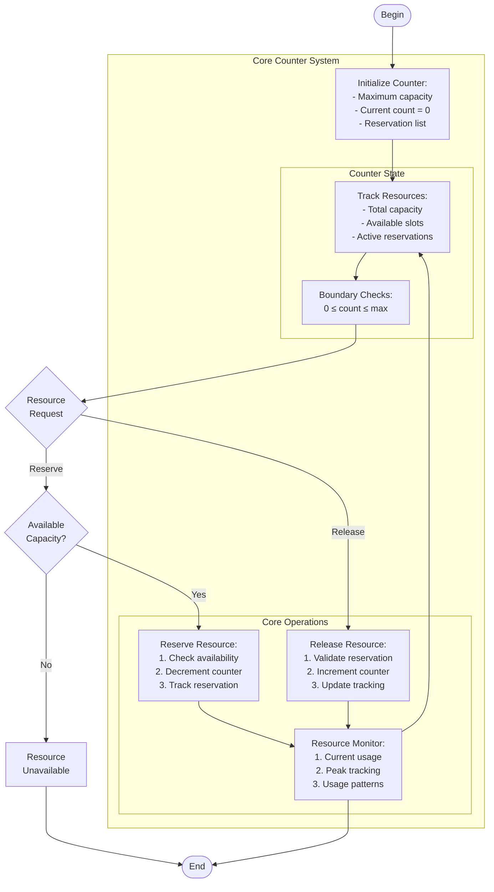

# reservation_counter.c

Description

Implements a reservation/counter system—could be used to demonstrate counting resources, booking slots, or semaphore-like behavior.

Features

- Reserve (decrement available)
- Release (increment available)
- Display current availability

Compile (Windows PowerShell)

```powershell
gcc -o reservation_counter.exe reservation_counter.c
.\reservation_counter.exe
```

Usage

Run and interact via menu to reserve or release resources.

## Core Algorithm (Mermaid flowchart)



Algorithm explanation:
1. Resource Management:
   - Atomic counter operations
   - Bounds checking (0 to max)
   - Reservation tracking
2. Core Operations:
   - Reserve: O(1) with validation
   - Release: O(1) with tracking
   - Monitor: Continuous state check
3. Safety Features:
   - Prevent overflow/underflow
   - Track invalid operations
   - Monitor usage patterns

Notes

- Thread-safe operations needed for concurrent access
- Can be extended with reservation timeouts