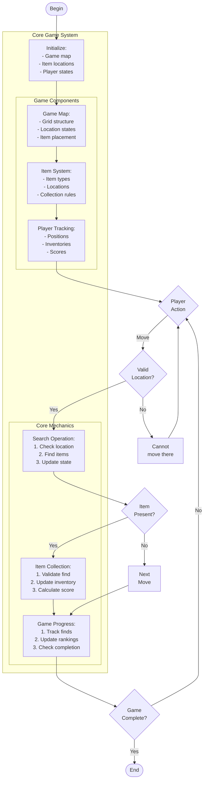

# scavenger_hunt.c

Description

Simulates a scavenger hunt game: players search for items on a map or list; demonstrates search, state tracking, and scoring.

Features

- Place items in locations
- Players search and collect items
- Track scores and completion

Compile (Windows PowerShell)

```powershell
gcc -o scavenger_hunt.exe scavenger_hunt.c
.\scavenger_hunt.exe
```

Usage

Run and use menu to start game, move players, collect items, and view scores.

## Core Algorithm (Mermaid flowchart)



Algorithm explanation:
1. Game Setup:
   - Initialize map grid
   - Place items randomly
   - Set player starting positions
2. Core Mechanics:
   - Movement validation
   - Item discovery
   - Score calculation
3. Game Progress:
   - Track item collection
   - Update player standings
   - Check win conditions

Notes

- Map can be grid or location list
- Items can have different values/rules