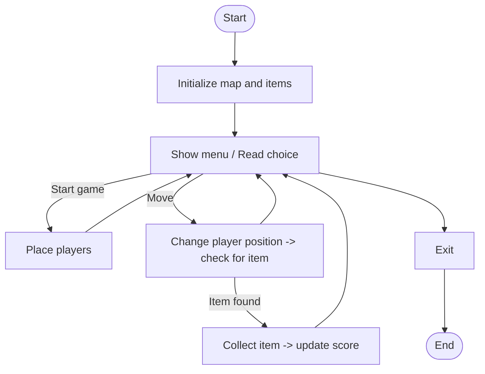

# scavenger_hunt.c

Description

Simulates a scavenger hunt game: players search for items on a map or list; demonstrates search, state tracking, and scoring.

Features

- Place items in locations
- Players search and collect items
- Track scores and completion

Compile (Windows PowerShell)

```powershell
gcc -o scavenger_hunt.exe scavenger_hunt.c
.\scavenger_hunt.exe
```

Usage

Run and use menu to start game, move players, collect items, and view scores.

## Code flow (Mermaid flowchart)



Notes

- Include game-specific rules if implementation differs.
