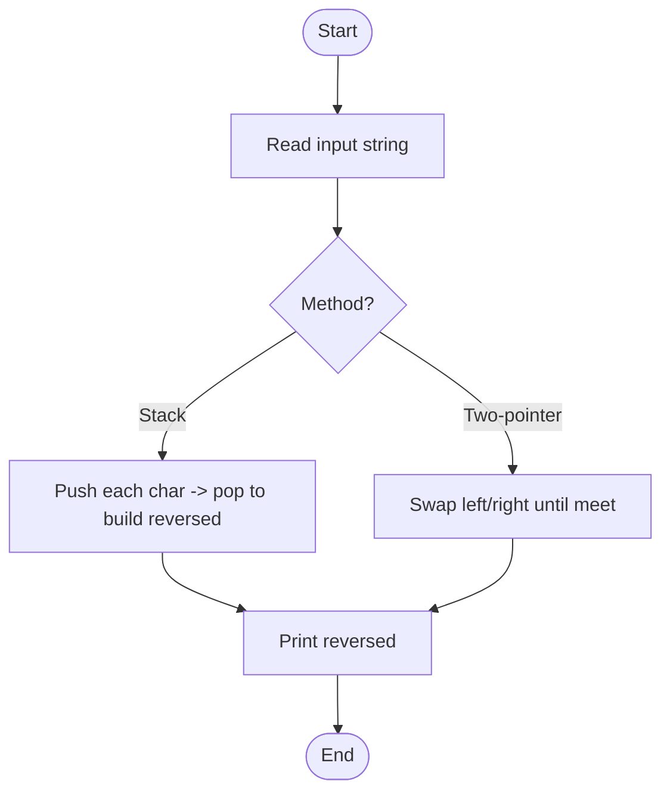

# string_reversal.c

Description

Reverses input strings using stack or in-place swapping. Educational example for string manipulation.

Features

- Reverse string using stack or two-pointer method
- Handle newline/whitespace

Compile (Windows PowerShell)

```powershell
gcc -o string_reversal.exe string_reversal.c
.\string_reversal.exe
```

Usage

Enter a string when prompted; program prints the reversed string.

## Code flow (Mermaid flowchart)



Notes

- Handle empty string and unicode cautiously (C char-based handling is byte-oriented).
