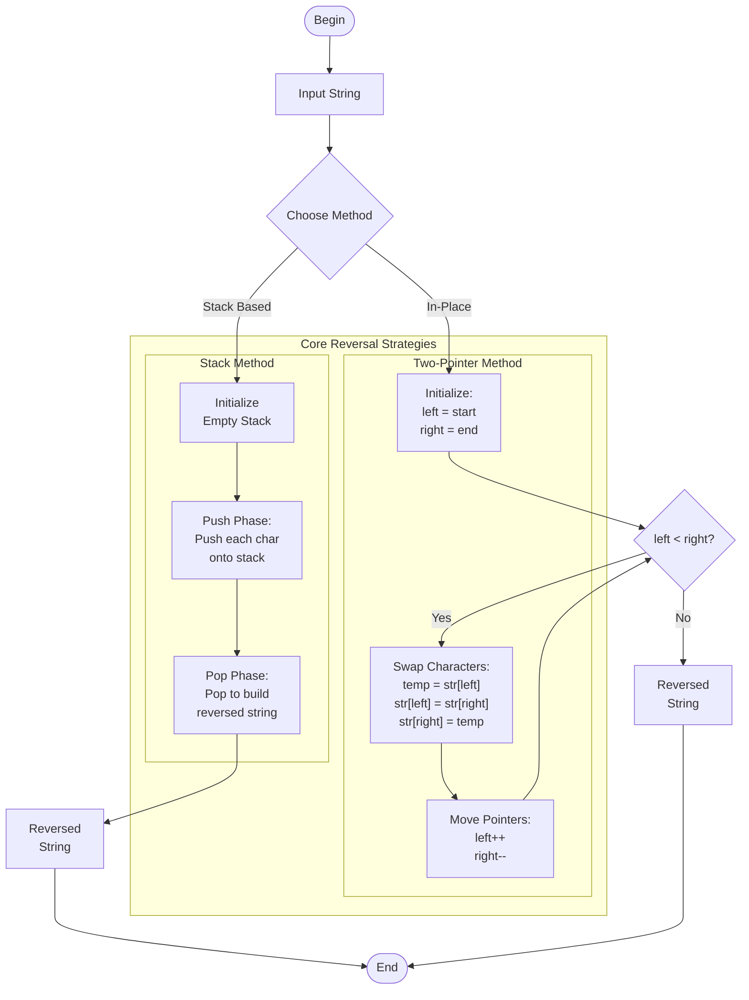

# string_reversal.c

Description

Reverses input strings using stack or in-place swapping. Educational example for string manipulation.

Features

- Reverse string using stack or two-pointer method
- Handle newline/whitespace

Compile (Windows PowerShell)

```powershell
gcc -o string_reversal.exe string_reversal.c
.\string_reversal.exe
```

Usage

Enter a string when prompted; program prints the reversed string.

## Core Algorithm (Mermaid flowchart)



Algorithm explanation:
1. Stack-based reversal:
   - Space: O(n)
   - Time: O(n)
   - Non-destructive to original
2. Two-pointer reversal:
   - Space: O(1)
   - Time: O(n)
   - Modifies original string
3. Key differences:
   - Stack preserves original
   - Two-pointer is memory efficient

Notes

- Handle empty string and unicode characters carefully
- Consider string length for method selection