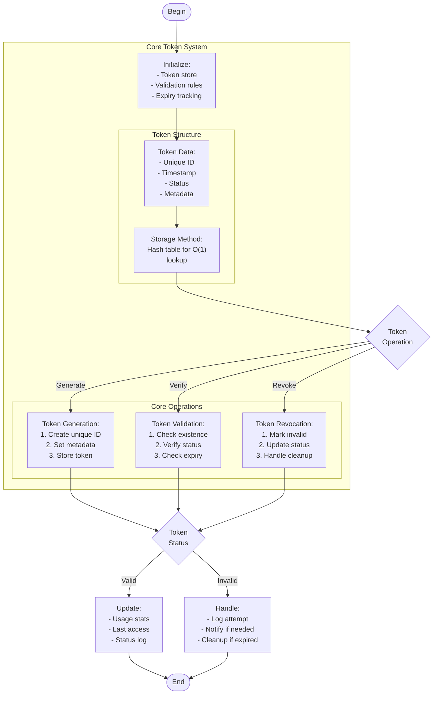

# token_system.c

Description

Implements a token issuance/validation system (e.g., simple authentication tokens or resource tokens) demonstrating string handling and lookup.

Features

- Issue tokens
- Validate tokens
- Revoke tokens

Compile (Windows PowerShell)

```powershell
gcc -o token_system.exe token_system.c
.\token_system.exe
```

Usage

Run and use menu to issue, validate, and revoke tokens.

## Core Algorithm (Mermaid flowchart)



Algorithm explanation:
1. Token Management:
   - Unique ID generation
   - Status tracking
   - Expiry handling
2. Core Operations:
   - Issue: O(1) generation and storage
   - Validate: O(1) lookup and check
   - Revoke: O(1) status update
3. Security Features:
   - Unique ID verification
   - Status validation
   - Access tracking

Notes

- For production use:
  - Add secure random generation
  - Implement proper encryption
  - Use secure storage methods