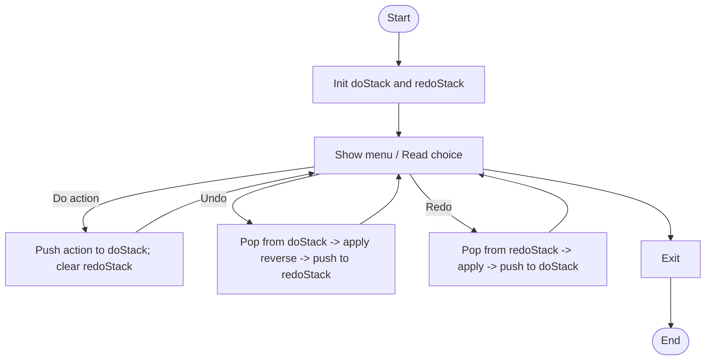

# undo_operation.c

Description

Demonstrates undo/redo functionality using stacks: push operations on do-stack, pop to undo, push undone on redo-stack.

Features

- Perform operations (example: text edits)
- Undo and redo
- Show current state

Compile (Windows PowerShell)

```powershell
gcc -o undo_operation.exe undo_operation.c
.\undo_operation.exe
```

Usage

Run the program and use menu to perform actions, undo, and redo.

## Code flow (Mermaid flowchart)



Notes

- Extend action model to store enough info to revert operations.
