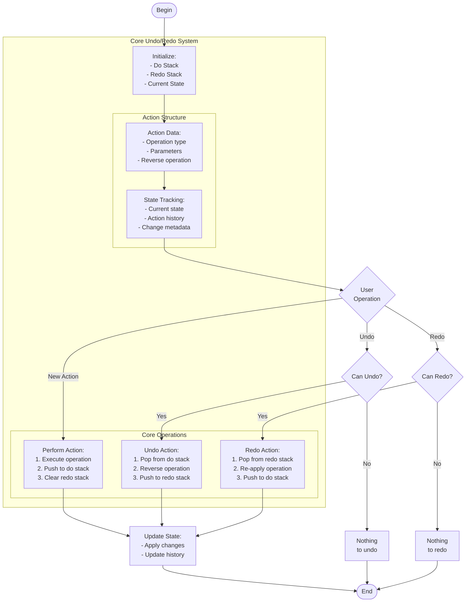

# undo_operation.c

Description

Demonstrates undo/redo functionality using stacks: push operations on do-stack, pop to undo, push undone on redo-stack.

Features

- Perform operations (example: text edits)
- Undo and redo
- Show current state

Compile (Windows PowerShell)

```powershell
gcc -o undo_operation.exe undo_operation.c
.\undo_operation.exe
```

Usage

Run the program and use menu to perform actions, undo, and redo.

## Core Algorithm (Mermaid flowchart)



Algorithm explanation:
1. Stack Management:
   - Two stacks for bidirectional history
   - Each action stores reverse operation
   - Clear redo on new action
2. Core Operations:
   - Do: Execute and store
   - Undo: Reverse last action
   - Redo: Reapply undone action
3. State Handling:
   - Track current state
   - Maintain action history
   - Validate operations

Notes

- Similar to text editor undo/redo
- Can be extended for complex operations